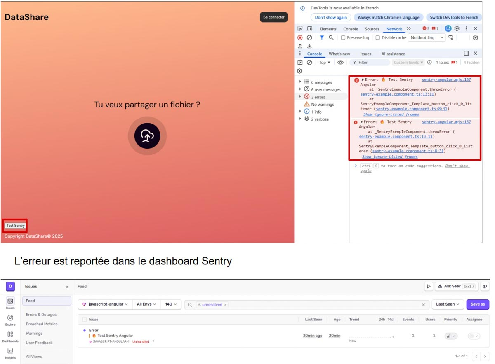

# MAINTENANCE

## Objectif

Ce document décrit les procédures de maintenance de l'application (Angular frontend, API .NET Core, base de données PostgreSQL), ainsi que la fréquence des interventions et les risques associés.


## Procédures de mise à jour

### Front-end (Angular)

* Pour vérifier les mises à jour, ouvrez un terminal à la racine du projet DataShare_Web et éxécutez :

  ```bash
  npm outdated
  ```

* Pour mettre à jour les dépendances, ouvrez un terminal à la racine du projet DataShare_Web et éxécutez :

  ```bash
  npm update
  ```

* Pour mettre à jour la version majeure Angular, ouvrez un terminal à la racine du projet DataShare_Web et éxécutez :

  ```bash
  ng update
  ```


### Back-end (.NET Core)

* Pour vérifier les mises à jour, ouvrez une console Powershell à la racine du projet DataShare_API et éxécutez :

  ```bash
  dotnet list package --outdated
  ```

* Pour mettre à jour les dépendances, ouvrez une console Powershell à la racine du projet DataShare_API et éxécutez :


  ```bash
  dotnet add package <nom_package>
  ```


### Base de données (PostgreSQL)

* Les modifications de structure de la base de données devront l'objet d'un commentaire précis dans le commit

```
feat!: Migration requise - ...
```

Dans ce cas, afin d'appliquer les nouveaux changements effectués sur la base de données, stoppez l'application (si elle est démarrée), ouvrez une console Powershell à la racine du projet DataShare_API et éxécutez :

```
./start-database.ps1
```

* Pour sauvegarder la base de données, ouvrez un terminal dans un répertoire de votre choix et éxécutez :

  ```bash
  docker exec -i postgres_db pg_dump -U <user> -d <datashare> > datashare-backup.sql
  ```

* Restauration :

  ```bash
  docker exec -i postgres_db pg_dump -U <user> -d <datashare> < datashare-backup.sql
  ```

## Fréquence de mise à jour de dépendances

Dans le cadre de ce MVP, et dû aux risques identifiés dans la section suivante, aucune fréquence de mise à jour automatique des dépendances n'est activée. En cas de mise en production, ce point devra faire l'objet d'une prise de décision.

Néanmoins `Dependabot` est activé afin de générer des alertes (envoi d'un mail) en cas de vulnérabilité (ou malware) identifiée dans les dépendances du projet. 
De plus, dans ce cas, Github générera automatiquement une pull request. Un merge manuel reste cependant à valider.

Par contre, `Dependabot version updates` est désactivé par défaut.

## Risques de mises à jour des dépendances

Les mises à jour de dépendances présentent de nombreux risques :

* Comportement inattendu
* Introduction de bugs
* Suppression de méthodes entraînant un problème de compilation
* Risque d'incompatibilité entre dépendances
* Risque de stabilité en production (dans le cas de dépendance mise à jour automatiquement sans test préalables)
* ...

Ainsi, bien que des outils comme Dependabot facilitent la détection des mises à jour, leur intégration doit être contrôlée via des tests automatisés et une validation humaine avant mise en production.

## Implémentation de Sentry

