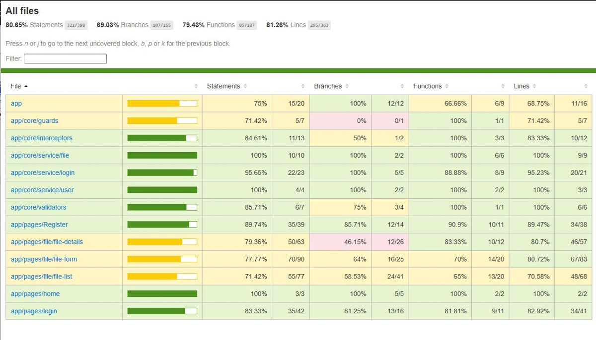

## Tests Cypress end-to-end 

ATTENTION : Pour l'éxecution des tests e2e, assurez-vous que le back-End ainsi que le front-End soit 
correctement démarré

Pour lancer les tests e2e sans couverture de code, ouvrir un terminal à la racine du projet DataShare_Web et éxécutez :

```bash
npm run e2e
```

Pour lancer les tests e2e avec couverture de code, ouvrir un terminal à la racine du projet DataShare_Web et éxécutez :

```bash
npm run cy:coverage
```

Au préalable, si vous souhaitez faire un clean du rapport de couverture, ouvrir un terminal à la racine 
du projet DataShare_Web et éxécutez :

```bash
npm run coverage:clean
```

Pour générer un rapport de couverture, une fois les tests e2e executés, ouvrir un terminal à la racine 
du projet DataShare_Web et éxécutez :

```bash
npm run coverage:report
```

Le rapport est disponible dans le répertoire `/coverage/combined/index.html`.

## Console Cypress

Pour ouvrir la console Cypress, ouvrir un terminal à la racine du projet DataShare_Web et éxécutez :

```bash
npx cypress open
```

## Rapport

Rapport généré le 20/04/2026


